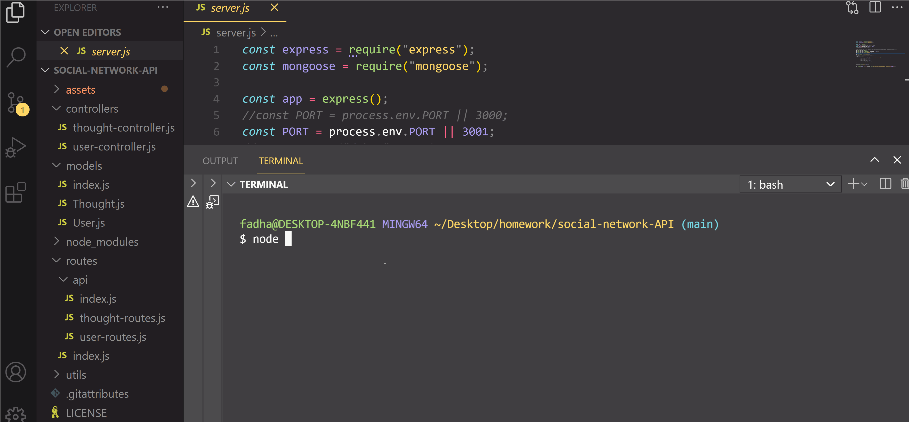

## Tittle
 social-network-API

## User Story
AS A social media startup
I WANT an API for my social network that uses a NoSQL database
SO THAT my website can handle large amounts of unstructured data

##  Challenge description 
This challenge involved creating a social network backend using MongoDB and Express that allows users to share their thoughts, react to friend's thoughts, and create a friend list. 
Express.js was used for routing and a MongoDB database was created.

## Testing 
API routes were tested using Insomnia Core.and you will be able to successfully create and delete reactions to thoughts and add and remove friends to a user’s friend list.

## Links
https://github.com/fadhaa89/social-network-API

## walkthrough video

## Author
Fadhaa Abdullah  
fadhaaabdullah8991@gmail.com